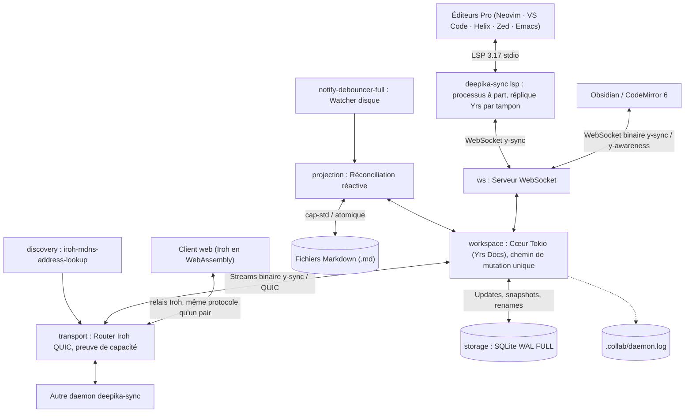

# Architecture

Un daemon par dossier partagé. Il possède la session, l'état des documents (Yrs), leur
persistance (SQLite) et le transport entre pairs (Iroh QUIC). Les éditeurs s'y
connectent par deux standards, LSP et WebSocket y-sync, et ne parlent jamais aux pairs.

## Les quatre parties

### 1. Interfaces éditeur
Deux standards, décrits dans [protocoles éditeur](../reference/editor-protocol.md) :
`lsp.rs` sert LSP 3.17 sur stdio et est lui-même un client WebSocket du daemon, une
réplique Yrs par tampon ; `ws.rs` sert y-sync et y-awareness, un document par URL. Le
client web ne passe par aucun des deux : il embarque Iroh en WebAssembly et se présente
au transport comme un pair, par le relais.

### 2. Cœur : `Workspace`
Le moteur documentaire (`workspace.rs`) tourne sous Tokio ; les appels bloquants (commit SQLite en `synchronous=FULL`, écriture atomique des fichiers) sont déportés par `spawn_blocking`.
- Les documents sont des `yrs::Doc` à offsets **UTF-16** contenant le texte (`"content"`) et la carte de métadonnées (`"metadata"` : `path`, `deleted`), seule source de vérité du chemin.
- **Un seul chemin de mutation**, `Workspace::mutate` : appliquer la transaction, ignorer ce qui est déjà connu, trancher une collision de chemin, persister, puis annoncer. Frappes, imports disque, mises à jour distantes et renommages y passent tous.
- Les baux d'édition (*leases*) comptent les connexions d'éditeur ouvertes sur un document.
- Chaque `WorkspaceEvent` **porte la mise à jour binaire** : le transport et le WebSocket la rediffusent telle quelle, sauf à la connexion d'origine. L'awareness (curseurs, présence) est relayée de même, sans être interprétée ; le dernier état de chaque éditeur est retenu en mémoire pour être remis à qui arrive.

### 3. Projection entre le disque et le CRDT
`projection.rs` réconcilie les deux sens. Un changement sur disque entre dans le CRDT
comme un **diff minimal**, pour fusionner avec les changements concurrents ; une
mise à jour reçue est écrite atomiquement dans le fichier. Tant qu'un éditeur tient un
document (bail), ni l'un ni l'autre : l'éditeur est responsable de son tampon, et le
dernier bail relâché déclenche l'écriture. Les renommages appariés par le watcher
suivent l'identité du document ; au démarrage, le dossier est rattrapé de ce qui a changé
pendant l'arrêt. Le détail est dans [durabilité](durability.md).

### 4. Réseau P2P & Découverte Zero-Conf
- **Iroh QUIC (`transport.rs`)** : `iroh::protocol::Router` accepte les connexions sur l'ALPN `deepika-sync/yrs/2`. Chaque connexion s'ouvre par une preuve mutuelle de la capacité (BLAKE3 keyed, liée aux deux identités) ; la capacité elle-même ne circule jamais.
- **Le même protocole y-sync qu'avec les éditeurs** (`yrs::sync`), un document par message : `SyncStep1`/`SyncStep2` à la connexion, puis `Update` au fil de l'eau. Un `SyncStep1` sur un document inconnu du destinataire le fait demander en entier. `preview.rs` obtient de l'hôte, avant de rejoindre, le manifeste de la session (chemins, tombstones, empreintes) sans rien écrire.
- **Rappel des pairs** : l'hôte de l'invitation et les pairs trouvés sont mémorisés (`config.peers`) et rappelés tant que le daemon tourne, avec une pause qui double de 1 à 30 s. À distance rien d'autre ne retrouve un pair : c'est ce qui rétablit la synchronisation après une coupure réseau, une mise en veille ou le redémarrage de l'un des deux.
- **mDNS LAN (`discovery.rs`)** : `iroh-mdns-address-lookup`, avec un nom de service dérivé du hash de la capacité : seuls les pairs de la même session se découvrent.

## Modules

| Module | Rôle |
| :--- | :--- |
| `workspace` | Instances `yrs::Doc`, chemin de mutation unique, collisions de chemin, compaction, baux et événements |
| `storage` | Persistance SQLite (mises à jour Yrs, instantanés compactés, index des documents, verrou de session) |
| `projection` | Réconciliation réactive entre le disque Markdown et les documents Yrs |
| `preview` | Manifeste de la session et plan de ce que rejoindre changera, pour le consentement |
| `lsp` | Serveur LSP 3.17 sur `stdio`, client WebSocket du daemon |
| `ws` | Serveur WebSocket `y-sync` / `y-awareness`, contrôle d'origine, une connexion = un bail |
| `transport` | Transport P2P sur QUIC Iroh (`Router`), preuve de capacité, framing `y-sync` |
| `discovery` | Découverte mDNS des pairs de la session (`iroh-mdns-address-lookup`) |
| `filesystem` | Confinement sécurisé des accès disques (`cap-std`) et écritures atomiques |
| `logging` | Tracing : terminal, et fichier JSON borné dans `.collab` (`file-rotate`, `tracing-appender`) |
